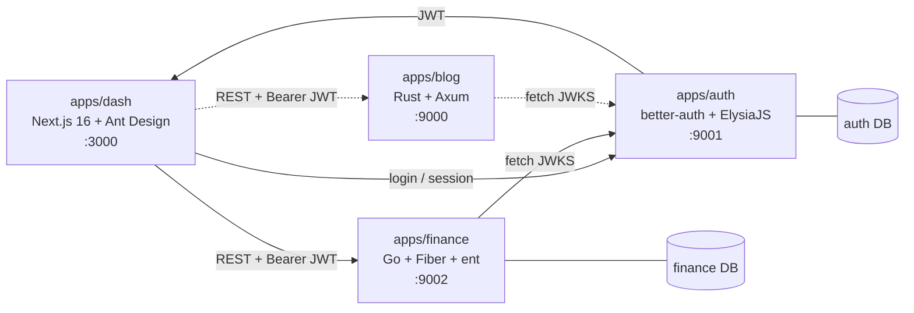

# Omed

> A demo application on steroids. Deliberately overengineered.

Omed is a polyglot monorepo (Turborepo) that stitches together a Next.js dashboard, a Go finance service, a Rust blog service, and a standalone auth service. Auth is centralized with better-auth, and every backend verifies JWTs via JWKS.

## Architecture



- **dash** logs users in through the auth service, receives a short-lived JWT, and calls backends with `Authorization: Bearer <jwt>`.
- **finance** and **blog** never talk to the auth DB. They only verify JWTs against the auth service's JWKS endpoint.
- Each app owns its own database.

## Repo layout

| Path | Stack | Description |
| --- | --- | --- |
| `apps/dash` | Next.js 16, Ant Design, Tailwind | Dashboard UI |
| `apps/auth` | Bun, ElysiaJS | Thin runner for the auth server |
| `apps/finance` | Go, Fiber v3, entgo, Casbin | Double-entry finance API |
| `apps/blog` | Rust, Axum, sqlx | Blog API (early scaffold) |
| `packages/better-auth` | better-auth, Drizzle, Elysia | Auth core: config, schema, services, client |
| `packages/tsconfig` | TypeScript | Shared tsconfig (`@omed/tsconfig`) |

## Tech highlights

**Auth (`packages/better-auth`)**
- better-auth with `admin`, `organization` (+ teams), `jwt`, `bearer` plugins
- Social login: Google & GitHub
- Every user gets a personal organization + personal team on signup (the "workspace")
- JWT payload carries user id, active organization/team, and roles
- Drizzle ORM on Postgres (`auth` schema), PGlite for tests

**Finance (`apps/finance`)**
- Double-entry bookkeeping: `accounts` (hierarchical chart of accounts), `ledger_period`, `entry`, `posting`, `exchange_rate`
- Multi-currency, base currency is per workspace
- Multi-tenant by workspace: ent hooks/interceptors scope every query and mutation to `workspace_id`
- UUIDv7 primary keys
- RBAC with Casbin (`model.conf` + `policy.csv`)
- JWT verification via JWKS (`keyfunc/v3`)
- Cursor-based search with filters and sorting

**Dash (`apps/dash`)**
- App Router, Ant Design with a custom theme
- `AuthProvider` handles session, JWT refresh, and a typed API client
- Type-safe finance client via `openapi-fetch`

## Prerequisites

- [Bun](https://bun.sh) (package manager + auth runtime)
- Node.js (for Next.js)
- Go (see `apps/finance/go.mod`)
- Rust (edition 2024)
- PostgreSQL

## Getting started

```bash
# install deps
bun install

# run everything (turbo)
bun run dev
```

### Environment

**`packages/better-auth` / `apps/auth`**

| Variable | Default | Notes |
| --- | --- | --- |
| `AUTH_BASE_URL` | `http://localhost:9001` | |
| `AUTH_BASE_PATH` | `/` | |
| `AUTH_SECRET` | | required |
| `AUTH_DB_URL` | | required |
| `AUTH_DB_DRIVER` | | `node` or `neon` |
| `AUTH_SCHEMA_NAME` | `auth` | |
| `AUTH_GOOGLE_ID` / `AUTH_GOOGLE_SECRET` | placeholder | OAuth |
| `AUTH_GITHUB_ID` / `AUTH_GITHUB_SECRET` | placeholder | OAuth |

**`apps/finance`**

| Variable | Default | Notes |
| --- | --- | --- |
| `PORT` | `9002` | |
| `DATABASE_URL` | | required (Postgres) |
| `JWKS_URL` | `http://localhost:9001/jwks` | |
| `SEARCH_LIMIT` | `10` | default page size |

**`apps/dash`**

| Variable | Default | Notes |
| --- | --- | --- |
| `NEXT_PUBLIC_AUTH_URL` | `http://localhost:9001` | |
| `NEXT_PUBLIC_AUTH_PATH` | `/` | |
| `NEXT_PUBLIC_API_FINANCE_URL` | | finance base URL |

### Run individually

```bash
# auth (from repo root)
bun run --filter @omed/auth dev
# push auth schema
bun run --filter @omed/better-auth db:push

# dash
cd apps/dash && bun run dev        # http://localhost:3000

# finance
cd apps/finance && go run ./cmd/api  # :9002

# blog
cd apps/blog && cargo run            # :9000
```

### Tests

```bash
# auth package (Vitest + PGlite)
bun run --filter @omed/better-auth test

# finance
cd apps/finance && go test ./... -p 1
```

> Finance tests spin up a mock JWKS server on a fixed port, so run them serially (`-p 1`).

## Ports

| Service | Port |
| --- | --- |
| dash | 3001 |
| auth | 9001 |
| finance | 9002 |
| blog | 9003 |

## Status

Work in progress. Many dashboard pages are still `UnderConstruction`, and `apps/blog` is just a health endpoint for now.

## License

MIT

Built with ❤️ and ☕