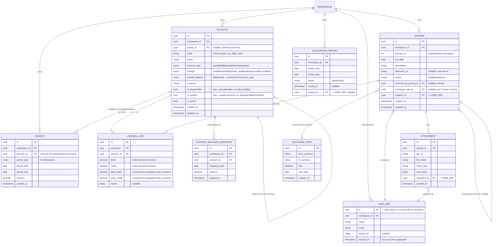

# ERD — apps/finance (Personal Accounting, Double-Entry, Standard COA)

Scope: double-entry bookkeeping, per-Workspace (tenant), budgeting, attachment/receipt. Aligned to standard accounting practice (GnuCash / QuickBooks / Beancount patterns).

## Diagram

## Business Rules

1. **Unified Chart of Accounts**: no separate `Category` table — Income & Expense are `Account` rows (`account_type = income|expense`), same tree as Asset/Liability/Equity.
2. **Account hierarchy**: `parent_id` builds the COA tree. `is_placeholder = true` marks group/header accounts — only leaf accounts receive `JOURNAL_LINE` postings.
3. **normal_balance**: `asset`/`expense` = debit-normal; `liability`/`equity`/`income` = credit-normal.
4. **subtype** (`cash|bank|ewallet|credit_card|payable|receivable`) only applies to `asset`/`liability` accounts; `null` otherwise.
5. **No `opening_balance` field.** Opening balance is a normal `Journal`: debit the new account, credit a system `Opening Balance Equity` account (`account_type = equity`, `is_system = true`). Keeps every balance traceable purely from `JOURNAL_LINE` — no out-of-band number breaking the double-entry invariant.
6. **Balanced entry**: `SUM(debit) = SUM(credit)` per `JOURNAL`, minimum 2 `JOURNAL_LINE` rows.
7. **Transfer**: `JOURNAL` between two asset/liability accounts, no income/expense touched — no special table needed.
8. **Budget**: scoped to an income/expense `Account` + period; actual spend computed from `JOURNAL_LINE` at query time.
9. **Balance calculation**: `ACCOUNT_BALANCE_SNAPSHOT` written periodically; current balance = latest snapshot + `SUM(lines)` posted after `snapshot_date`.
10. **Multi-currency**: `Workspace.base_currency` + dated `EXCHANGE_RATE`. `JOURNAL_LINE` stores native + base-currency amounts; `Journal.exchange_rate_id` is the audit trail of which rate was applied.
11. **Journal lifecycle**: `draft` (editable, not counted) → `posted` (immutable, counted in balances) → `void`. Voiding **never deletes or edits a posted journal** — it creates a reversing `Journal` and links it via `reversed_by_journal_id`, preserving full audit history.
12. **Period locking**: `ACCOUNTING_PERIOD` with `status = closed` blocks new/edited postings with `txn_date` inside that period — standard books-closing control.
13. **User reference**: `apps/finance` does not FK directly into `apps/auth`'s DB (different service/DB). `USER_REF` is a local shadow table, synced from `apps/auth` (event-driven or lazy-cache), used only for display/audit — never for auth/permission decisions (Casbin remains source of truth for that).
14. All top-level entities carry `workspace_id` — enforced by Casbin RBAC as domain, consistent with existing apps/finance pattern.
